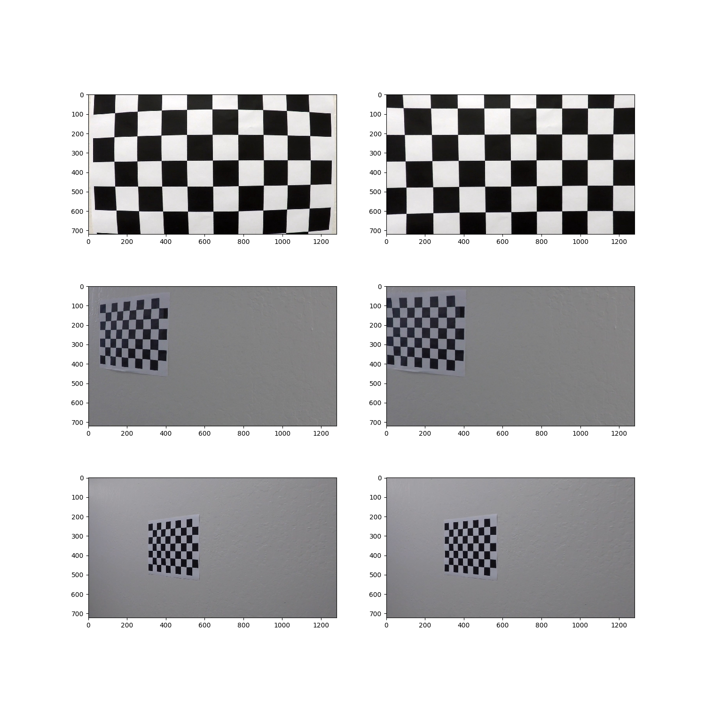
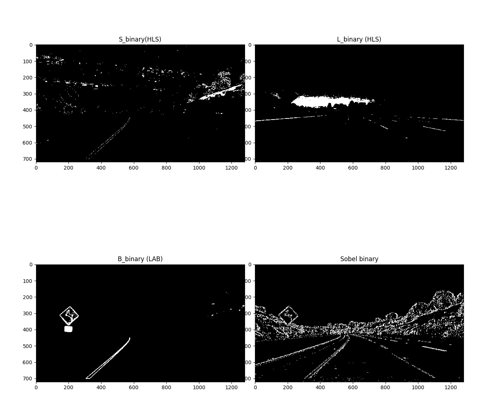
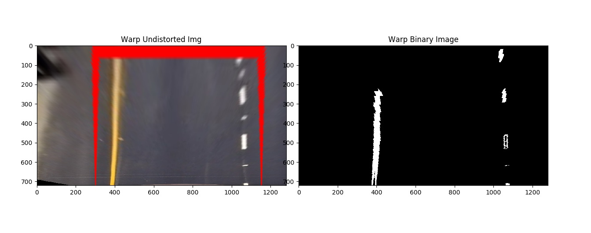
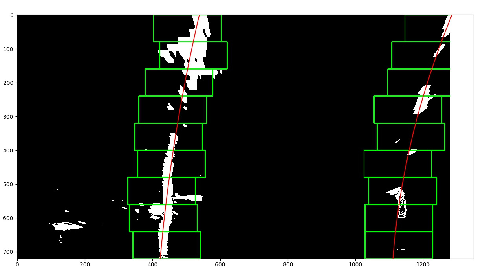

## Advanced Lane Finding

The goal of the project was to write a software pipeline to identify the lane boundaries in a video. Here I will elaborate how I implemented the pipeline. I will address all requirements in the project rubric below.

Note: The pipeline has been implemented in file called **AdvancedLaneFind _pipeline.py**
### Compute the camera calibration matrix and distortion coefficients given a set of chessboard images
To compute the calibration matrix, I used Open CV  methods `findChessboardCorners`, `calibrateCamera` and `undistort`. Since this calibration is required to be done only once for a camera and lense, I saved the calibration matrix and distortion measure to a pickle format file. While developing the pipeline, I load the saved matrix and use it for undistorting all images. A sample of undistorted checkerboard images are available below:

### Pipeline
The different stages of image processing are explained below 
####Thresholding 
In order to obtain a binary image containing likely image pixels, I explored the following
* Computing grayscale image derivative in x-direction using the **Sobel**  operator
* Converting from RGB to HLS color space and using thresholds on the **S-channel** and **L-channel**
* Converting RGB to LAB color space and using threshold on the **B-channel**

The sobel operator responds well to intensity changes so it is able to capture the lane lines but also activates when there are shadows and other illumination changes. 

The S-channel from HSV space and B-channel from LAB space capture the yellow lane line very well. However S-channel activates in low lighting conditions too whereas the B-channel consistently captures the yellow lines with low noise. 

The L-channel from HLS space captures the white lane lines well but also responds to changes in illumination in the image.

Some thresholding results are shown below

After observing the thresholding results I decided to use a combination of thresholding on L-channel and B-Channel to identify yellow and white lane lines. The method `thresholdImage` returns the thresholded binary image

###Perspective Transform
To transform the camera images from perspective into bird-eye view I used OpenCV method `warpPerspective`. To calculate the perspective transform and inverse-perspective transform I chose 4 points  from one of the test images having straight lane lines and specified 4 corresponding destination points. The source and destination points are hard-coded as :

	
    src_pts = np.float32([[250,img_height-50],
                                 [580,450],
                                 [700,450],
                                 [1050,img_height-50]])
    
    dest_points = np.float32([[400,img_height],
                             [400,0],
                             [img_width-400,0],
                             [img_width-400,img_height]])

A sample of warped images using the perspective transform is available below

### Lane pixel identification
To identify lane line pixels in warped binary image, I sum number of non-zero (white) pixels in each column of lower half of image. The columns with maximum relevant pixels on the left half and  right half of image are recorded as the base of lane line.
Once the base location of left and right lane line has been identified, a sliding window search is used to identify lane line pixels. The number of windows to be used, and window width are configurable. 
The search algorithm works as explained below:
1. Start at base positions of left and right line - create window using width and height
2. Finds all pixels lying inside the current window and add them to a list of points that form the lane line
3. If number of pixels exceed a set threshold, the x_position of next window center is updated to centroid of pixels found
4. Update window location, goto step 2 and repeat until till entire height of image is covered

Once coordinates of all pixels belonging to lanes have been identified, a second degree polynomial is fit to these coordinates. The sliding search is implemented in method called `slidingWindowSearch`
 

The images for camera calibration are stored in the folder called `camera_cal`.  The images in `test_images` are for testing your pipeline on single frames.  If you want to extract more test images from the videos, you can simply use an image writing method like `cv2.imwrite()`, i.e., you can read the video in frame by frame as usual, and for frames you want to save for later you can write to an image file.  

To help the reviewer examine your work, please save examples of the output from each stage of your pipeline in the folder called `ouput_images`, and include a description in your writeup for the project of what each image shows.    The video called `project_video.mp4` is the video your pipeline should work well on.  

The `challenge_video.mp4` video is an extra (and optional) challenge for you if you want to test your pipeline under somewhat trickier conditions.  The `harder_challenge.mp4` video is another optional challenge and is brutal!

If you're feeling ambitious (again, totally optional though), don't stop there!  We encourage you to go out and take video of your own, calibrate your camera and show us how you would implement this project from scratch!

